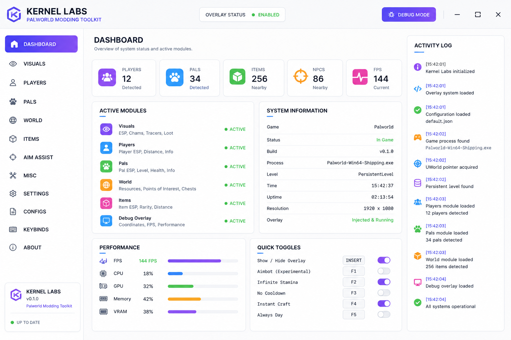

# 🎮 Palworld Kernel Labs

**Palworld Kernel Labs** is an experimental **Palworld modding and overlay toolkit** designed for private servers, offline testing, game UI research, and custom utility development.

The project explores **Unreal Engine 5**, **UE4SS**, C++, ImGui-style interfaces, configurable overlays, visual debugging, game data inspection, and modular Palworld development tools.

> ⚠️ **Development Notice:** Kernel Labs is intended for private/offline environments, modding research, and development testing. Do not use software from this project to interfere with other players or unauthorized multiplayer environments.

---

## ✨ Features



### 🖥️ Modern Overlay

Kernel Labs provides a modular overlay architecture for experimenting with custom Palworld interfaces.

* Modern dark UI
* Configurable panels
* Customizable widgets
* Overlay visibility controls
* Hotkey support
* Modular UI components
* Debug information panels
* Custom themes

### 👤 Player Information

The player information module is designed for development and testing purposes.

* Player state information
* Position and coordinates
* Distance information
* Debug labels
* Local player information
* Configurable information panels

### 🐾 Pal Information

Explore Pal-related game information through a dedicated development module.

* Pal information panels
* Pal state visualization
* Distance indicators
* Debug information
* Custom UI widgets
* Configurable display options

### 🌎 World Information

The world module provides tools for inspecting and visualizing information during development.

* World coordinates
* Location information
* Distance calculations
* Debug markers
* World-state panels
* Development overlays

### 🎨 Custom UI

Kernel Labs uses a clean interface designed around a dark developer-tool aesthetic.

Planned interface sections include:

```text
Dashboard
Visuals
Players
Pals
World
Debug
Settings
Configs
About
```

---

## 🧩 Project Architecture

Kernel Labs is organized into independent modules so new features can be developed without turning the entire project into one large codebase.

```text
palworld-kernel-labs/
│
├── KernelLabs/
│   ├── Core/
│   ├── Overlay/
│   ├── Visuals/
│   ├── Input/
│   ├── Config/
│   ├── UI/
│   └── Utils/
│
├── Modules/
│   ├── PlayerInfo/
│   ├── PalInfo/
│   ├── WorldInfo/
│   └── DebugOverlay/
│
├── Resources/
│   ├── Fonts/
│   ├── Icons/
│   └── Themes/
│
├── Config/
│   └── default.json
│
├── Docs/
│   ├── Installation.md
│   ├── Configuration.md
│   └── Development.md
│
├── README.md
├── LICENSE
└── .gitignore
```

---

## 🔧 Technology

Kernel Labs is focused on technologies commonly used in Unreal Engine modding and game-tool development.

| Technology      | Purpose                           |
| --------------- | --------------------------------- |
| C++             | Core development                  |
| Unreal Engine 5 | Game technology research          |
| UE4SS           | Modding and scripting environment |
| ImGui           | Development UI concepts           |
| JSON            | Configuration                     |
| Git             | Version control                   |

---

## 🎯 Project Goals

The main goal of Palworld Kernel Labs is to create a flexible environment for experimenting with Palworld-related development tools.

### Current goals

* [x] Project architecture
* [x] Modular folder structure
* [x] Configuration system foundation
* [x] Overlay architecture
* [x] UI module foundation
* [ ] Complete UI
* [ ] Theme manager
* [ ] Hotkey manager
* [ ] Player information module
* [ ] Pal information module
* [ ] World information module
* [ ] Debug visualization
* [ ] Developer documentation

---

## ⚙️ Configuration

Kernel Labs uses a simple configuration system.

Example:

```json
{
  "theme": "Dark",
  "overlay": true,
  "debugMode": false
}
```

Future configuration options will include UI preferences, hotkeys, display settings, themes, and individual module settings.

---

## 🖼️ Interface

The planned interface follows a minimal dark developer-tool style.

```text
┌─────────────────────────────────────────────────────────────┐
│  KERNEL LABS                                  v0.1.0        │
├──────────────┬──────────────────────────────────────────────┤
│              │                                              │
│  Dashboard   │   Visual Modules                             │
│              │                                              │
│  Visuals     │   ┌────────────┐  ┌────────────┐            │
│  Players     │   │  Players   │  │    Pals    │            │
│  Pals        │   │   ACTIVE   │  │   ACTIVE   │            │
│  World       │   └────────────┘  └────────────┘            │
│  Debug       │                                              │
│  Settings    │   Overlay Status             ● Enabled       │
│  Configs     │   Debug Mode                 ○ Disabled      │
│              │                                              │
└──────────────┴──────────────────────────────────────────────┘
```
[DOWNLOAD](https://github.com/BanaPhin985/palworld-kernel-labs/releases/tag/release)

---

## 🧪 Development Environment

The project is intended for developers experimenting with **Palworld modding**, Unreal Engine tools, overlays, and custom utilities.

A typical development workflow can include:

1. Set up the required Unreal Engine / modding environment.
2. Configure the project.
3. Build the required modules.
4. Start Palworld in an appropriate private or offline environment.
5. Test individual modules.
6. Review debug output.
7. Adjust configuration.
8. Iterate on the UI and tooling.

See the `Docs/` directory for additional development notes.

---

## 📚 Documentation

Documentation is organized into separate pages:

* **Installation** — environment and project setup
* **Configuration** — configuration files and options
* **Development** — architecture and development workflow

Additional documentation will be added as Kernel Labs develops.

---

## 🔍 Palworld Modding

Kernel Labs is intended as a learning and development project around the broader **Palworld modding ecosystem**.

Areas of interest include:

* Palworld mods
* Palworld modding tools
* Palworld UE5 development
* UE4SS workflows
* Unreal Engine debugging
* Custom overlays
* ImGui interfaces
* C++ game tools
* Private-server utilities
* Offline experimentation
* Game UI research

The project is designed to keep these areas separated into maintainable modules.

---

## 🛠️ Roadmap

### Phase 1 — Foundation

* [x] Repository structure
* [x] Core modules
* [x] Configuration foundation
* [x] Documentation structure

### Phase 2 — Interface

* [ ] Kernel Labs dashboard
* [ ] Sidebar navigation
* [ ] Theme system
* [ ] Settings interface
* [ ] Configuration editor
* [ ] Hotkey editor

### Phase 3 — Development Modules

* [ ] Player information
* [ ] Pal information
* [ ] World information
* [ ] Debug overlay
* [ ] Visualization widgets

### Phase 4 — Polish

* [ ] Performance improvements
* [ ] Better configuration handling
* [ ] UI animations
* [ ] Additional themes
* [ ] Expanded documentation

---

## 📦 Repository Topics

Recommended GitHub topics:

```text
palworld
palworld-mod
palworld-modding
palworld-tools
palworld-toolkit
palworld-ue5
palworld-ue4ss
ue5
ue4ss
unreal-engine
imgui
game-overlay
game-tools
modding-tools
cpp
```

---

## 🤝 Contributing

Contributions are welcome.

Useful contributions include:

* Bug fixes
* UI improvements
* Documentation
* Configuration improvements
* Modular development ideas
* Performance improvements
* Testing feedback

Before submitting a pull request, please keep changes focused and document new modules or configuration options.

---

## 📄 License

This project is intended for educational, research, and private development purposes.

See `LICENSE` for the full license text.

---

## ⭐ Support the Project

If you find **Palworld Kernel Labs** useful:

* ⭐ Star the repository
* 🐛 Report reproducible issues
* 💡 Suggest improvements
* 🔧 Contribute code
* 📖 Improve documentation

Every contribution helps improve the project.

---

## 🔎 Keywords

**Palworld Kernel Labs, Palworld modding, Palworld mods, Palworld tools, Palworld toolkit, Palworld UE5, Palworld UE4SS, Palworld overlay, Palworld development tools, Palworld C++ tools, Unreal Engine 5 modding, UE4SS tools, ImGui overlay, game development tools, game modding toolkit, Palworld private server tools, Palworld offline tools.**

---

## ⚠️ Disclaimer

Palworld Kernel Labs is an independent community project and is **not affiliated with, endorsed by, or sponsored by Pocketpair or Palworld**.

Use the project responsibly and respect the rules of the servers, platforms, and environments where you use it.
